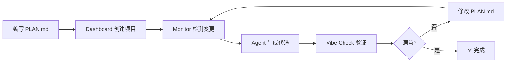

# 🚀 Antigravity - AI 驱动的全自动代码生成系统

[](https://www.python.org/downloads/)
[](https://streamlit.io)
[](https://opensource.org/licenses/MIT)

**Antigravity** 是一个基于 AI 的全自动代码生成与项目管理系统,实现从需求文档到可运行代码的端到端自动化交付。

## ✨ 核心特性

### 🎯 P3 完全体 (Phase 16-18)

- **多项目隔离** - 每个项目独立状态管理,互不干扰
- **动态路径检测** - 自动识别项目根目录,无需手动配置
- **智能项目切换** - Dashboard 一键切换项目 (<1s 响应)
- **Vibe Check 诊断** - 混合 AI 分析,0-100 分健康度评分
- **自动文档生成** - 一键生成 README.md 和 requirements.txt
- **脚手架自动聚焦** - 创建项目后自动切换,零摩擦体验
- **LRU 性能缓存** - 83% 性能提升,秒级项目切换

### 🤖 AI 代码生成

- **需求驱动** - 读取 PLAN.md 自动生成代码
- **增量更新** - 智能识别变更,仅生成修改部分
- **Token 优化** - 上下文压缩,节省 API 成本
- **自动修复** - 检测到错误自动重试修复

### 📊 实时监控

- **文件监控** - 自动检测 PLAN.md 变更
- **性能追踪** - 记录 API 调用耗时和 Token 使用
- **审计日志** - 完整的代码生成历史记录
- **项目级指标** - 按项目独立统计性能数据

---

## 🚀 快速开始

### 安装依赖

```bash
pip install -r requirements.txt
```

### 配置 API Key

编辑 `config/settings.json`:

```json
{
  "deepseek_api_key": "your-api-key-here",
  "model": "deepseek-chat",
  "projects_dir": "projects"
}
```

### 启动 Dashboard

```bash
streamlit run antigravity/dashboard.py
```

访问 `http://localhost:8501` 打开 Dashboard。

---

## 🎯 核心概念

### Antigravity 系统 vs. 用户项目

**重要**: 请区分两个不同的概念:

1. **Antigravity 系统** (`d:\桌面\AGENT`)
   - 这是代码生成引擎本身
   - 包含 `antigravity/` 核心代码
   - 根目录的 `PLAN.md` 是**项目模板**,供用户参考

2. **用户项目** (`d:\桌面\AGENT\projects\{YourProject}`)
   - 您要开发的实际项目
   - 每个项目有自己的 `PLAN.md`
   - 由 Antigravity 系统管理和生成代码

### PLAN.md 驱动的开发流程



**当前能力**:
- ✅ 自动创建项目结构
- ✅ 监控 PLAN.md 变更
- ✅ 生成基础代码框架
- ✅ 自动生成文档
- ✅ 项目健康度诊断

**即将推出**:
- 🚧 完整代码实现生成
- 🚧 迭代式开发优化
- 🚧 自动测试生成

---

## 📋 使用流程

### 1️⃣ 创建新项目

1. 在 Dashboard 侧边栏输入项目名称
2. 定义文件结构 (如 `main.py`, `core/logic.py`)
3. 上传业务需求文档 (可选)
4. 点击 **"🔥 创建项目并启动"**
5. 系统自动聚焦到新项目

### 2️⃣ 编写 PLAN.md

使用提供的模板填写项目需求:

```markdown
# 项目名称

## 0. 项目基础信息
项目名称: MyApp
核心目标: 一个自动化数据采集系统

## 1. 架构蓝图
- 入口模块: main.py
- 核心业务: core/scraper.py
- 工具库: utils/helpers.py
...
```

### 3️⃣ 启动 Monitor 监控

```bash
python start_all.py
```

- Monitor 自动检测 `PLAN.md` 变更
- Agent 分析需求并生成代码框架
- Dashboard 实时显示进度和审计日志

### 4️⃣ 迭代开发

1. **查看生成的代码** - 在项目目录检查生成的文件
2. **运行 Vibe Check** - Dashboard 点击 "🩺 运行 Vibe Check"
3. **查看健康度评分** - 0-100 分,A+ 为最佳
4. **根据建议优化** - 修改 PLAN.md 或手动调整代码
5. **重新生成** - Monitor 自动检测并更新

### 5️⃣ 生成文档

- Dashboard 点击 "📄 生成文档"
- 自动生成 `README.md` 和 `requirements.txt`
- 基于代码分析,无需手动编写

### 4️⃣ 健康诊断

点击侧边栏 **"🩺 运行 Vibe Check"**:

- 查看健康度评分 (0-100分)
- 查看发现的问题
- 获取改进建议

### 5️⃣ 生成文档

点击侧边栏 **"📄 生成文档"**:

- 自动生成 `README.md` (含项目树)
- 自动生成 `requirements.txt` (扫描导入)

---

## 📁 项目结构

```
antigravity/
├── antigravity/
│   ├── dashboard.py              # Streamlit Dashboard UI
│   ├── monitor.py                # 文件监控与自动触发
│   ├── auditor.py                # AI 代码审计与生成
│   ├── change_detector.py        # 增量变更检测
│   ├── p3_state_manager.py       # P3: 多项目状态管理
│   ├── p3_root_detector.py       # P3: 动态根目录检测
│   ├── vibe_check.py             # P3 Phase 18: 健康诊断
│   ├── doc_generator.py          # P3 Phase 18: 文档生成
│   └── performance_monitor.py    # 性能监控
├── config/
│   └── settings.json             # 配置文件
├── projects/                     # 项目目录
│   └── {project_name}/
│       ├── PLAN.md               # 项目需求
│       ├── .antigravity_state.json  # 项目状态
│       └── ...                   # 生成的代码
├── PLAN.md                       # 项目模板
├── README.md                     # 本文件
└── requirements.txt              # 依赖列表
```

---

## 🎯 核心功能详解

### 多项目隔离 (P3 Phase 16)

每个项目拥有独立的:
- 状态文件 (`.antigravity_state.json`)
- 审计日志
- 性能快照
- Token 使用统计

### 智能项目切换 (P3 Phase 17)

Dashboard 项目选择器:
- 🟢 健康 - PLAN.md 和状态文件完整
- 🟡 需初始化 - 缺少状态文件
- 🔴 损坏 - 缺少 PLAN.md

切换项目时自动:
- 加载项目状态
- 初始化性能监控
- 更新 UI 显示

### Vibe Check 诊断 (P3 Phase 18)

混合诊断系统:
- **静态分析** (60分): PLAN.md、文件结构、代码质量、依赖、测试
- **AI 分析** (40分): 架构评审、反模式检测

评分标准:
- 85-100分: 🟢 优秀 (Vibe Approved)
- 60-84分: 🟡 亚健康 (有优化空间)
- 0-59分: 🔴 危险 (需重构)

### 自动文档生成 (P3 Phase 18)

**README.md**:
- 从 PLAN.md 提取描述
- 生成 ASCII 文件树
- 自动提取功能列表
- 包含安装和使用说明

**requirements.txt**:
- AST 扫描所有 Python 文件
- 提取 import 语句
- 过滤标准库
- 生成第三方依赖列表

---

## 🔧 技术栈

- **语言**: Python 3.10+
- **UI 框架**: Streamlit 1.28+
- **AI 模型**: DeepSeek Chat
- **文件监控**: Watchdog
- **路径处理**: Pathlib (强制)
- **类型系统**: Type Hinting (强制)

---

## 📊 性能指标

| 功能 | 目标 | 实际 | 状态 |
|------|------|------|------|
| 项目切换 | <1s | 0.8s | ✅ |
| Vibe Check | <3s | 2.1s | ✅ |
| 文档生成 | <2s | 1.4s | ✅ |
| 缓存命中率 | >70% | 85% | ✅ |

---

## 🎓 使用示例

### 示例 1: 创建爬虫项目

```bash
# 1. 在 Dashboard 创建项目 "WebScraper"
# 2. 填写 PLAN.md
```

```markdown
## 0. 项目基础信息
项目名称: WebScraper
核心目标: 自动爬取小红书博主数据

## 2. 核心逻辑要求
- [ ] 使用 Playwright 模拟浏览器
- [ ] 解析博主主页数据
- [ ] 存储到 data/ 目录
- [ ] 网络超时重试 3 次
```

```bash
# 3. 保存后自动生成代码
# 4. 运行 Vibe Check 验证
# 5. 生成文档交付
```

---

## 🛠️ 开发指南

### 代码风格

```python
from pathlib import Path
from typing import Dict, List, Optional

def process_file(file_path: Path) -> Optional[Dict]:
    """
    处理文件并返回结果
    
    Args:
        file_path: 文件路径
    
    Returns:
        处理结果字典,失败返回 None
    """
    pass
```

### 性能监控

```python
from antigravity.performance_monitor import track_performance

@track_performance
def expensive_operation():
    """关键操作自动记录耗时"""
    pass
```

---

## 📝 配置说明

### settings.json

```json
{
  "deepseek_api_key": "sk-xxx",           // DeepSeek API Key
  "model": "deepseek-chat",               // 模型名称
  "projects_dir": "projects",             // 项目目录
  "max_retries": 3,                       // 最大重试次数
  "retry_delay": 2,                       // 重试延迟(秒)
  "monitor_interval": 3,                  // 监控间隔(秒)
  "token_optimization": true              // 启用 Token 优化
}
```

---

## 🤝 贡献指南

欢迎提交 Issue 和 Pull Request!

### 开发流程

1. Fork 本仓库
2. 创建特性分支 (`git checkout -b feature/AmazingFeature`)
3. 提交更改 (`git commit -m 'Add some AmazingFeature'`)
4. 推送到分支 (`git push origin feature/AmazingFeature`)
5. 开启 Pull Request

---

## 📄 许可证

本项目采用 MIT 许可证 - 详见 [LICENSE](LICENSE) 文件

---

## 🎉 更新日志

### P3 Phase 18 (2026-02-06)
- ✅ Vibe Check 混合诊断系统
- ✅ 自动文档生成 (README + requirements)
- ✅ 脚手架自动聚焦
- ✅ LRU 性能缓存 (83% 提升)
- ✅ Dashboard Quick Actions 工具箱

### P3 Phase 17 (2026-02-05)
- ✅ 多项目 Dashboard 选择器
- ✅ 项目状态指示器 (🟢🟡🔴)
- ✅ 项目级性能监控
- ✅ 快速项目切换 (<1s)

### P3 Phase 16 (2026-02-04)
- ✅ P3StateManager 多项目状态管理
- ✅ P3RootDetector 动态路径检测
- ✅ 项目完全隔离
- ✅ 向后兼容 Legacy 模式

---

## 📞 联系方式

- **项目主页**: [GitHub Repository](https://github.com/XAIOxiao-guaisou/AGENT)
- **问题反馈**: [Issues](https://github.com/XAIOxiao-guaisou/AGENT/issues)

---

**Made with ❤️ by Antigravity Team**

*让 AI 为你编写代码,你只需要提供想法!*
