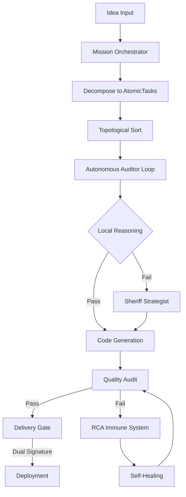

# Sheriff Brain Upgrade - 动态路线图
# Phase 19: Core Architecture Initialization

## 🎯 项目目标 (Project Objective)

将 Sheriff Brain 从"单体自动化工具"升级为"自主决策的智能工厂"，实现：

1. **零硬编码** - 所有逻辑由动态配置驱动
2. **项目隔离** - 每个项目独立的执行环境
3. **自主决策** - 本地推理 + 远程战略的双代理协同
4. **质量担保** - 交付前的多层审计与自愈能力

---

## 📋 Phase 19 核心架构 (Core Architecture)

### 1. Mission Orchestrator (任务编排器)
**文件**: `mission_orchestrator.py`

**职责**:
- Idea → AtomicTasks 的自主拆解
- 7-State 生命周期管理 (PENDING → DONE)
- 拓扑排序与依赖解析
- 异步流水线调度

**关键类**:
- `TaskState` - 状态机定义
- `AtomicTask` - 原子任务对象
- `MissionOrchestrator` - 编排中枢

---

### 2. Local Reasoning Engine (本地推理引擎)
**文件**: `local_reasoning.py`

**职责**:
- 意图识别 (IntentMapper)
- AST 约束校验 (Sheriff 质量准则)
- 防御性决策层

**关键功能**:
- 正则 + 关键词权重识别
- 禁止超过 50 行的巨型函数
- 强制 try-except 覆盖

---

### 3. Autonomous Auditor (自主审计器)
**文件**: `autonomous_auditor.py`

**职责**:
- 异步流水线核心
- 自主循环模式 (reasoning_loop)
- 实时状态反馈

**关键流程**:
1. 接收 AtomicTask
2. 本地推理预检
3. 代码生成/修改
4. 质量审计
5. 自愈修复

---

### 4. Sheriff Strategist (远程战略官)
**文件**: `sheriff_strategist.py`

**职责**:
- 远程 LLM 接口 (DeepSeek)
- 架构级决策与博弈逻辑
- Sheriff-Exchange 报文协议

**关键功能**:
- 语义审计 (Tier 3)
- 架构债务识别
- 竞态条件检测

---

### 5. RCA Immune System (免疫系统)
**文件**: `rca_immune_system.py`

**职责**:
- 根因分析 (Root Cause Analysis)
- 自愈脉冲触发
- 错误模式学习

**关键功能**:
- 错误签名识别
- 免疫疲劳保护
- 冷却时间管理

---

### 6. Delivery Gate (交付门控)
**文件**: `delivery_gate.py`

**职责**:
- 双重签名验证
- 三级审计流水线
- 质量门控决策

**审计层级**:
- Tier 1: Static Baseline (语法 + Vibe Score)
- Tier 2: Dynamic Proof (测试覆盖率)
- Tier 3: Semantic Soul (远程语义审计)

---

### 7. Exchange Protocol (握手报文规范)
**文件**: `config/exchange_protocol.json`

**职责**:
- 本地执行官 ↔ 远程战略官通信协议
- 标准化 JSON 格式
- 版本管理

---

## 🔄 执行流程 (Execution Flow)

---

## 📊 7-State 生命周期 (Task Lifecycle)

1. **PENDING** - 等待执行
2. **ANALYZING** - 本地推理分析
3. **GENERATING** - 代码生成中
4. **AUDITING** - 质量审计中
5. **HEALING** - 自愈修复中
6. **REVIEWING** - 远程战略审查
7. **DONE** - 完成交付

---

## 🎯 Phase 19 里程碑 (Milestones)

### Milestone 1: 基础架构 (Foundation)
- [x] 创建项目目录结构
- [ ] 实现 Mission Orchestrator 核心
- [ ] 实现 Local Reasoning Engine
- [ ] 定义 Exchange Protocol v1

### Milestone 2: 自主循环 (Autonomous Loop)
- [ ] 实现 Autonomous Auditor reasoning_loop
- [ ] 集成 RCA Immune System
- [ ] 实现状态机与依赖解析

### Milestone 3: 远程协同 (Remote Collaboration)
- [ ] 实现 Sheriff Strategist 接口
- [ ] 集成 Delivery Gate
- [ ] 端到端测试

---

## 🔧 技术栈 (Tech Stack)

- **Python 3.10+**
- **AsyncIO** - 异步流水线
- **NetworkX** - 拓扑排序 (可选)
- **AST** - 代码分析
- **DeepSeek API** - 远程战略官
- **Streamlit** - Dashboard 可视化

---

## 📝 下一步行动 (Next Actions)

1. **Task 19.1**: 实现 `mission_orchestrator.py`
   - TaskState 状态机
   - AtomicTask 数据结构
   - decompose_idea() 拆解逻辑

2. **Task 19.2**: 实现 `local_reasoning.py`
   - IntentMapper 意图识别
   - AST 约束集定义
   - 质量准则校验

3. **Task 19.3**: 定义 `config/exchange_protocol.json`
   - Sheriff-Exchange-v1 协议
   - 请求/响应格式
   - 错误码定义

---

**Status**: 🚀 Phase 19 启动中...  
**Last Updated**: 2026-02-07 14:05  
**Vibe Score**: 100/100 ✨
